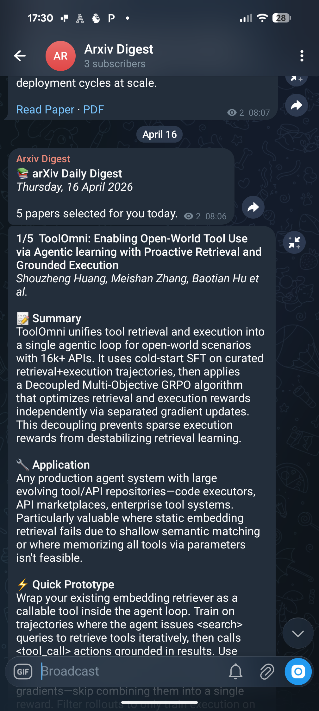

# 📚 LLM Paper Digest

I wanted to stay current with ML research without spending an hour a day triaging arXiv. Existing tools either sent me too much (daily category digests with 200 papers) or too little (curated newsletters that don't match my specific interests). This is the compromise: five papers a day, ranked against my own interest profile, summarised from the full PDF rather than just the abstract.

Runs as a Cloud Run Job on GCP, triggered by Cloud Scheduler. Infrastructure managed with Terraform.

## Architecture

```
Cloud Scheduler (8am Mon–Fri)
    → Cloud Run Job
        → arXiv API — fetch latest papers (titles + abstracts)
        → Claude (Sonnet) — rank top 5 by relevance
        → arXiv PDF download — fetch full papers
        → Claude (Haiku) — summarise each paper from the PDF
        → Telegram Bot API — send formatted digest
```

## What the Digest Looks Like

Each morning you get a Telegram message per paper, each containing:

* **Summary** — core concepts and key findings
* **Application** — where this research could be applied
* **Quick Prototype** — a concrete thing you could build with it
* **Impact** — what changes if this works at scale
* **Links** — direct links to the abstract and PDF

[](docs/sample-image.png)

## Setup

### Prerequisites

* A GCP project with billing enabled
* [Anthropic API key](https://console.anthropic.com) (Sonnet for ranking, Haiku for summaries — costs ~£1–2/month)
* A Telegram bot (create one via [@BotFather](https://t.me/BotFather))
* [Terraform](https://developer.hashicorp.com/terraform/install) >= 1.5

### 1. Create the Telegram Bot

1. Message [@BotFather](https://t.me/BotFather) on Telegram and send `/newbot`
2. Save the bot token
3. Create a channel and add the bot as an admin with "Post Messages" permission
4. Get the chat ID — either use `@your_channel_name` or send a message and visit `https://api.telegram.org/bot<TOKEN>/getUpdates` to find the numeric ID

### 2. Store Secrets in GCP Secret Manager

```bash
echo -n "sk-ant-..." | gcloud secrets create anthropic-api-key --data-file=-
echo -n "7123456..." | gcloud secrets create bot_key --data-file=-
echo -n "@your_channel" | gcloud secrets create telegram-chat-id --data-file=-
```

### 3. Deploy Infrastructure with Terraform

```bash
cd infrastructure
cp terraform.tfvars.example terraform.tfvars
# Edit terraform.tfvars with your project ID and preferences

terraform init
terraform plan
terraform apply
```

This provisions all GCP resources: APIs, service accounts, IAM bindings, the Cloud Run Job, and the Cloud Scheduler trigger.

### 4. Build and Deploy the Container

```bash
gcloud builds submit --project=YOUR_PROJECT_ID
```

This uses `cloudbuild.yaml` to build the Docker image, push it to Container Registry, and deploy as a Cloud Run Job.

### 5. Test It

```bash
gcloud run jobs execute arxiv-digest --region=europe-west2
```

## Infrastructure

All GCP resources are managed via Terraform in the `infrastructure/` directory.

### Resources Managed

| Resource | Purpose |
|---|---|
| `google_project_service` | Enables required GCP APIs (Cloud Run, Build, Scheduler, Secret Manager, Container Registry) |
| `google_service_account` (runner) | Dedicated SA for the Cloud Run Job — reads secrets at runtime |
| `google_service_account` (scheduler) | Dedicated SA for Cloud Scheduler — invokes the job |
| `google_secret_manager_secret_iam_member` | Grants the runner SA access to each secret |
| `google_cloud_run_v2_job` | The digest job itself — container config, env vars, secret mounts |
| `google_cloud_run_v2_job_iam_member` | Grants the scheduler SA permission to invoke the job |
| `google_cloud_scheduler_job` | Cron trigger — 8am weekdays London time by default |

Secrets are managed as Terraform resources. Their secret values should be added manually via `gcloud secrets versions add` after the initial `terraform apply` creates the secret shells.

### Terraform Variables

| Variable | Default | Description |
|---|---|---|
| `project_id` | — | GCP project ID |
| `region` | `europe-west2` | GCP region for all resources |
| `image` | — | Container image URI (updated by CI/CD) |
| `arxiv_categories` | `cs.AI,cs.LG,cs.CL,cs.SE,cs.IR` | arXiv categories to track |
| `arxiv_max_results` | `500` | Papers to fetch per run |
| `top_n_papers` | `5` | Papers to include in the digest |
| `claude_model_ranking` | `claude-sonnet-4-5-20250514` | Model for ranking |
| `claude_model_summary` | `claude-sonnet-4-5-20250514` | Model for summarisation |
| `schedule` | `0 8 * * 1-5` | Cron schedule |
| `schedule_timezone` | `Europe/London` | Scheduler timezone |

## Configuration

Environment variables are set via Terraform (in the Cloud Run Job definition) and can be overridden in `terraform.tfvars`:

| Variable | Default | Description |
|---|---|---|
| `ARXIV_CATEGORIES` | `cs.AI,cs.LG,cs.CL,cs.SE,cs.IR` | arXiv categories to fetch |
| `ARXIV_MAX_RESULTS` | `500` | Number of papers to fetch from arXiv |
| `TOP_N_PAPERS` | `5` | Number of papers to include in the digest |
| `CLAUDE_MODEL_RANKING` | `claude-sonnet-4-6` | Model used for ranking papers |
| `CLAUDE_MODEL_SUMMARY` | `claude-haiku-4-5-20251001` | Model used for PDF summarisation |
| `USER_INTERESTS` | See `main.py` | Your interest profile for ranking |

### Customising Your Interests

Edit the `USER_INTERESTS` variable in `main.py` to tune what papers Claude selects. The more specific you are, the better the ranking.

## Project Structure

```
├── job/
│   ├── app/
│   │   └── main.py              # Pipeline: fetch → rank → summarise → send
│   ├── Dockerfile
│   ├── pyproject.toml            # Dependencies managed via uv
│   └── uv.lock
├── infrastructure/
│   ├── main.tf                   # All GCP resources
│   ├── variables.tf              # Input variables
│   ├── outputs.tf                # Useful outputs (SA emails, job names)
│   └── terraform.tfvars.example  # Example variable values
├── docs/
│   └── sample-image.png          # Sample digest screenshot
├── cloudbuild.yaml               # CI/CD: build, push, deploy
└── README.md
```

## Design Decisions

**Two-model approach** — Sonnet handles ranking (needs stronger reasoning over many abstracts) while Haiku handles per-paper summarisation (simpler task, cheaper, and runs 5x). This keeps costs low without sacrificing ranking quality.

**arXiv API over email parsing** — The arXiv API returns structured data (titles, abstracts, IDs) directly, avoiding the fragility of parsing email HTML that could change format at any time.

**Cloud Run Job over Service** — This is a run-to-completion task, not a long-running server. Jobs are the right primitive: no health checks, no idle instances, no HTTP endpoint to secure.

**Dedicated service accounts** — Two separate SAs with minimal permissions: one for the job (secret access only), one for the scheduler (job invocation only). No use of the default compute SA.

**Terraform for infrastructure** — All GCP resources are declarative and reproducible. Secrets are the only manual step, kept outside Terraform to avoid sensitive values in state files.

**Rate limiting on PDF processing** — A 65-second delay between PDF summarisation calls avoids hitting arXiv's rate limits and API token limits.

## Costs

| Component | Cost |
|---|---|
| Cloud Run | Free tier (2M requests/month) |
| Cloud Scheduler | Free (3 jobs/month) |
| Claude API (ranking, Sonnet) | ~$0.02/day |
| Claude API (summaries, Haiku) | ~$0.20/day (~200k tokens across 5 PDFs) |
| arXiv API | Free, no key required |
| Telegram API | Free |
| **Total** | **~$5–7/month** |

## License

MIT